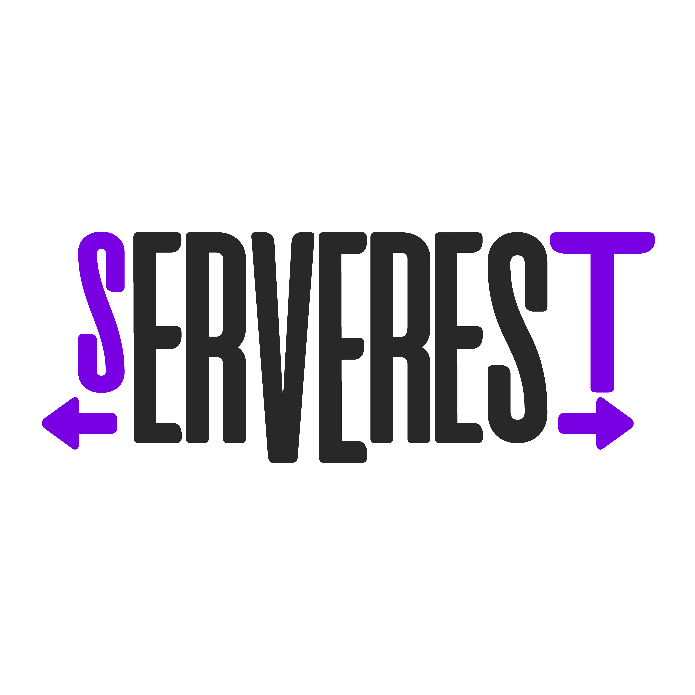

#  Serverest-cypress

Projeto denvolvido em [Node.js](https://nodejs.org/en/) com framework [Cypress](https://www.cypress.io/)

| **** | **** | **** |
|-------------|----------------|-------------|  

## 📘 Pré-requisitos

- <a href="https://nodejs.org/en/">Node.Js</a> - v. 22.16.0
- <a href="https://www.npmjs.com/">NPM</a> - v. 10.9.2
- <a href="https://www.cypress.io/">Cypress</a> - v. ^14.5.3
- <a href="https://fakerjs.dev/">fakerjs</a> - v. ^9.9.0
- <a href="https://www.npmjs.com/package/joi">JOI</a> - v. ^18.0.0

## :rocket: Como instalar a aplicação localmente

1. Para clonar repositório: 📑

    ```
    git clone https://github.com/QA-DaMata/serverest-cypress.git
    ```

2. Entrando na pasta: 🚪

     ```
     cd serverest-cypress
     ```

3. Para instalar as dependências necessárias/todas as dependências : ⬇️

    ```js
    //instalar todas as dependências:
    npm install
    //instalar somente as dependências necessárias:
   npm install --save-dev
    ```
    
4. Para iniciar o projeto No Cypress: 🤖 (Coloque cada código em um terminal.)

    ```
    npm run init-proj
    npx cypress open
    ```
    
5. Para iniciar o projeto pelo terminal ⚙️
   ```
    npx cypress run
   ```
    
